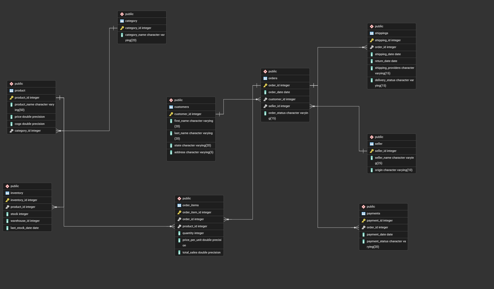

# 🛒 Amazon Sales Analysis using SQL

An end-to-end **e-commerce sales analysis project** built using SQL.  
This project simulates an Amazon-like marketplace database and solves real business problems related to **sales, customers, inventory, shipping, and seller performance** using advanced SQL queries.

It demonstrates strong skills in **database design, data analysis, and business intelligence using SQL**.

---

## 📌 Features

✔ Relational database design for an e-commerce system  
✔ 15+ real-world business analysis SQL queries  
✔ Sales performance and revenue trend analysis  
✔ Customer behavior and lifetime value analysis  
✔ Inventory monitoring and low-stock alerts  
✔ Shipping delay and return tracking  
✔ Seller performance and order success rate analysis  
✔ Profit margin and product return rate analysis  
✔ Use of CTEs, Window Functions, Ranking, and Aggregations  

---

## 🧠 Buisness Problem Statement

E-commerce businesses generate massive transactional data across orders, customers, products, payments, and logistics. Raw data alone is not useful unless it is analyzed to answer key business questions such as:

* Question 1: In the Orders table, the order_id column was mistakenly defined as a primary key with the MONEY data type instead of INT. Update the order_id column to use the INT data type.

* Question: 2 Query the Top 10 Products by Total sales value. Include Product name, total quantity sold, and total sales value

* Question 3 : Calculate total revenue generated by each product category. Include the percentage contribution of each category to total revenue

* Question 4: Compute the average Order value for each customer, Include Only the Customers with more than 5 Orders

* Question 5: Query Monthly Total Sales Over the Past year. Display the sales trend, grouping by month, return current_month_sales, Last Month Sales

* Question 6: Find the Customer registered but never placed an order, List customer details and the time since their registration.

* Question 7 : Identify the best-selling product for each state, Include the Total Sales for that category within each State.

* Question 8 : Identify the least-selling product for each state. Include the Total Sales for that category within each State.

* Question 9 : Calculate the total value of orders placed by each customer over their lifetime. Rank customers based on their Customer Lifetime Sales

* Question 10 : Query Products with stock levels below a certain threshold(e., less than 10 units), Include last restock date and warehouse information

* Question 11 : Identify orders where the shipping date is later than 4 days after the order date. Include customer, Order details, and delivery provider.

* Question 12 : Calculate the Percentage of successful payments, access all orders., Include breakdown by Payment status (eg., Failed,pending)

* Question 13 : Find the Top 5 sellers based on total Sales value., Include both successful and failed Orders, and Display their percentage of successful Orders

* Question 14 : Calculate the profit margin for much product (difference between price and cost of goods sold), Rank products by their profit margin, showing highest to lowest

* Question 15: Query the top 10 products by the number of return. Display the return rate as a percentage of total unitssold for each product

* Question 16: Identify Seller who haven't made any sales in the Last 6 month, Show the last sale date and total sales from those sellers

* Question 17: if the customer has done more than 5 return categorize them as returning otherwise new,.List customers id, name, total orders, total returns

* Question 18: Identify the Top 5 Customers with the Highest number of Orders for Each State. Include the Number of Orders and total Sales for each Customer.

* Question 19: Calculate the Total Revenue handled by each shipping provider. Include the Total Number of Orders handled and the Average delivery time for each provider

* Question 20: Top 10 Product with Highest decreasing revenue ratio compare to last year(2022) and current year(2023), Return product_id, Product_name, category_name,2022 revenue and 2023 Revenue decrease ratio at end Round the result

* Question 21: Create a function as soon as the product is sold the same quantity should reduced from Inventory table

Businesses need structured SQL analysis to convert operational data into **actionable insights**.

---

## 💡 Solution Overview

This project builds a **structured relational database** representing an Amazon-style sales system and performs deep analysis using SQL.

The solution includes:

1. Designing normalized tables for customers, orders, products, sellers, inventory, payments, and shipping  
2. Establishing relationships using **primary and foreign keys**  
3. Writing analytical SQL queries to extract insights about:
   - Sales trends  
   - Customer value  
   - Product performance  
   - Seller effectiveness  
   - Operational bottlenecks  

---

## 🏗️ System Architecture

**Data Flow**
Customers → Orders → Order Items → Payments & Shipping → Business Insights

### Database Relationships

- Customers place Orders  
- Orders contain multiple Order Items  
- Products belong to Categories  
- Sellers fulfill Orders  
- Payments store transaction details  
- Shipping tracks deliveries and returns  
- Inventory monitors stock levels  

### 🗺️ ERD Diagram

---

## 🛠️ Tech Stack

**Language**  
- SQL  

**Database Concepts**  
- Relational Database Design  
- Primary & Foreign Keys  
- Normalization  

**SQL Techniques Used**  
- CTEs (Common Table Expressions)  
- Window Functions (RANK, DENSE_RANK, LAG)  
- Aggregations (SUM, COUNT, AVG)  
- Subqueries  
- Joins (INNER, LEFT)  
- Date functions  
- Conditional logic  

**Tools & Platforms**  
- PostgreSQL / SQL-compatible RDBMS  
- pgAdmin (for ERD design)

---

## Project Overview: SQL-Driven Business Analysis for an E-Commerce Platform

This project involved building a comprehensive SQL database for an e-commerce platform similar to Amazon, aimed at analyzing sales, customer behavior, product trends, and monitoring inventory. The dataset includes multiple tables, each serving different aspects of the business:

**Dataset Overview:**
* The project uses 9 tables: Customers, Products, Categories, Sellers, Orders, Order Items, Shipping, Payments, and Inventory.
* Relationships were established through primary and foreign keys to ensure data integrity and enable complex queries.
  
**Key Analytical Goals**
* Evaluate sales trends, customer purchasing behavior, and product performance.
* Monitor inventory levels to prevent stock shortages and optimize supply chain management.
* Analyze customer returns and seller performance to enhance operational efficiency.

**Database Design:**
* The database mirrors Amazon's workflow with parent-child relationships, linking key tables like Customers, Sellers, and Orders.
* The design allows for thorough analysis of operations across various departments.

**Initial Setup & Data Import Process:**
* Data was imported from 9 CSV files into the Amazon_Db database, followed by adding primary keys and foreign key constraints.
* Attention was given to the integrity of the relationships between the tables, such as linking Products ↔ Categories and Orders ↔ Customers.

**Skills Demonstrated:**
* **Database Design & Integrity Management:** Ensured proper schema design, data integrity, and optimization of table structures.
* **Data Cleaning & Filtering:** Employed techniques like NULLIF() and COALESCE() for data cleaning and error handling.
* **Advanced Querying & Business Intelligence:** Used aggregations, window functions, and CTEs for complex analysis of sales, revenue, and customer trends.
* **Customer & Seller Performance Analysis:** Identified high-value customers and evaluated seller performance with rankings.
* **Sales & Revenue Insights:** Analyzed product sales, category contributions, return rates, and profit margins.
---

## 📊 Business Questions Solved

### 🔹 Sales & Revenue
- Top 10 best-selling products  
- Revenue contribution by category  
- Monthly and yearly sales trends  
- Average Order Value (AOV)

### 🔹 Customer Insights
- Customers with no purchases  
- Customer Lifetime Value (CLV) ranking  

### 🔹 Product Analysis
- Most returned products  
- Profit margin per product  
- Product sales performance by order status  

### 🔹 Seller Performance
- Top 5 sellers by revenue  
- Seller order success and cancellation rates  

### 🔹 Inventory & Operations
- Low stock product alerts  
- Shipping delays analysis  
- Payment success rate breakdown  

### 🔹 Geographic Insights
- Best and least selling categories by state  

---

## 📈 Advanced SQL Concepts Demonstrated

- Window Functions for ranking and growth trends  
- LAG() for month-over-month and year-over-year growth  
- CTEs for modular analytical queries  
- RANK() / DENSE_RANK() for performance comparison  
- CASE WHEN for return and order status analysis  

---

## ▶️ How to Run This Project

1️⃣ Create a database in PostgreSQL  
2️⃣ Run `Schemas.sql` to create tables  
3️⃣ Import all CSV files into their respective tables  
4️⃣ Execute queries from `Amazon SQL Script.sql`  

---

## 🎯 What This Project Demonstrates

✔ Strong SQL and database design skills  
✔ Ability to solve real business analytics problems  
✔ Understanding of e-commerce data models  
✔ Experience with performance analysis and reporting queries  

---
